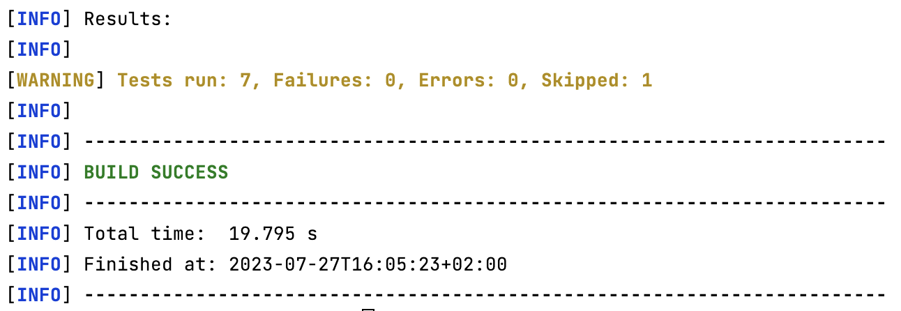
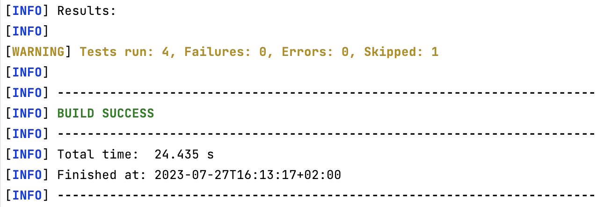
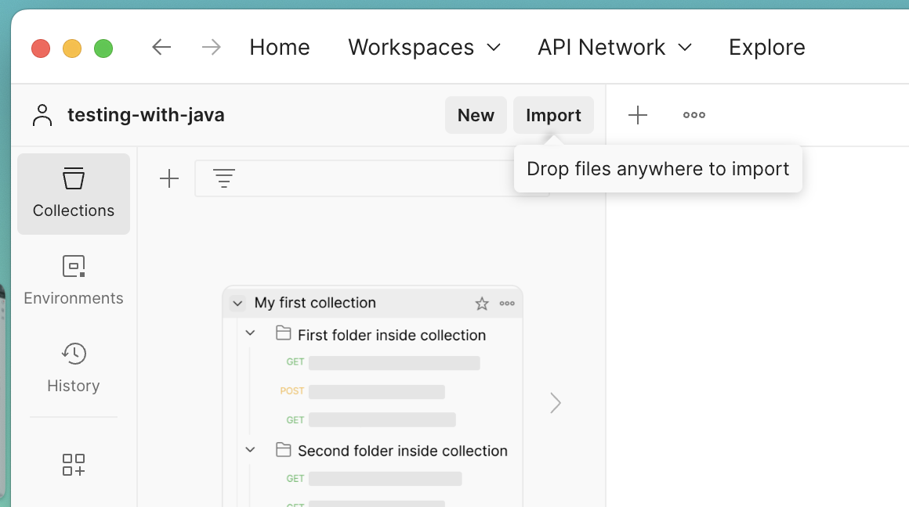
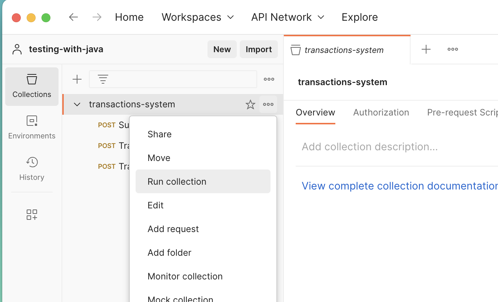
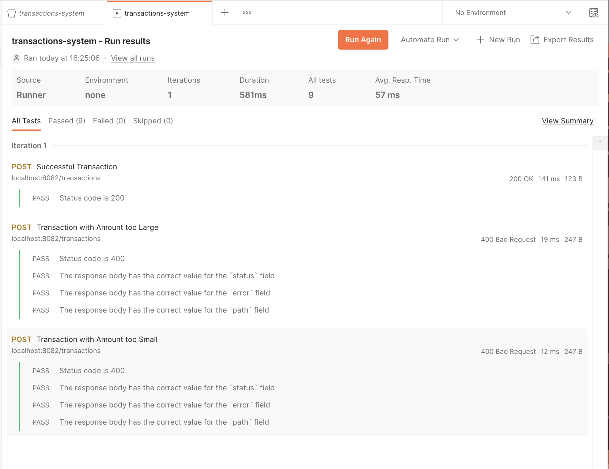

# Testing with Java

In this repository, we will use a simple Transaction Processing System to demonstrate 3 levels of testing in Java:
* Unit Testing
* Integration testing
* End-to-end Testing

## Overview

The functionality of Transaction Processing System can be summarized as follows.


## Unit Testing the Limits API

In the [limits-api/src/test](limits-api/src/test) directory, you will find the unit tests for the Limits API. In the `badtests` package,
we have some examples of what not to do when unit testing, while the other tests demonstrate good practices and
guidelines to follow when unit testing.

### Running the Unit Tests

The unit tests can be run using the following commands, provided that you have JDK 17 and maven installed on your machine:

```bash
cd limits-api
./mvnw test
```

You should see the following output:



There is a warning because 1 test is being skipped. This is our example of a bad test. It's just implemented to show
what not to do when unit testing. So, we have annotated it with `@Disabled` to skip it. The other tests are good examples
of unit tests.

## Integration Testing the Limits API

In the [transactions-api/src/test](transactions-api/src/test) directory, you will find an integration test of the 
Transactions API. In the `badtests` package, we have some examples of what not to do when integration testing. In this
case we have used `testcontainers` for integration testing. So, in order to run these tests, you will need to have
Docker installed and running on your machine.

### Running the Integration Tests

The integration tests can be run using the following commands, again provided that you have JDK 17 and maven installed on your machine:

```bash
cd transactions-api
./mvnw test
```

You should see the following output:



There is again a warning because 1 test is being skipped. You may again reference the skipped test as an example of
what not to do when integration testing. The other tests are good examples of integration tests.

## End-to-end Testing the Transaction Processing System

In the [testing-e2e](testing-e2e) directory, we have defined a docker-compose file that will run the entire system. 
That is, the Limits API, the Transactions API, and the databases. Also, we have created a Postman collection which
can be imported using [transactions-system.postman_collection.json](testing-e2e/transactions-system.postman_collection.json),
in order to test the system end-to-end.

### Running the End-to-End Tests

First, we need to start the system. This can be done using [docker-compose](https://docs.docker.com/compose/):

```bash
cd testing-e2e
docker-compose up -d
```

Now, you can open [Postman](https://www.postman.com). Import the collection using [transactions-system.postman_collection.json](testing-e2e/transactions-system.postman_collection.json):



Next, run the collection:



You should see the following results:



And that's a wrap, folks! I hope this repository has helped further your knowledge and understanding of Testing with Java.
Even if just a little bit. Thanks for checking it out!