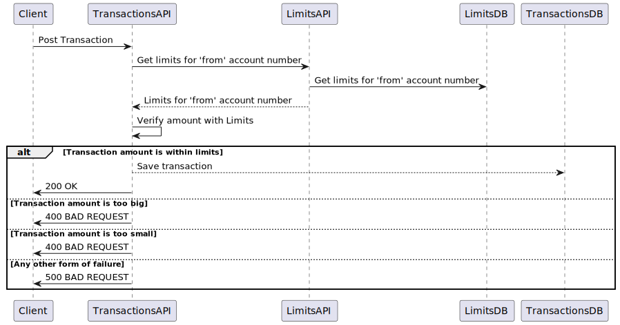

# Testing with Java

In this repository, we will use a simple Transaction Processing System to demonstrate 3 levels of testing in Java:
* Unit Testing
* Integration testing
* End-to-end Testing

## Overview

The functionality of Transaction Processing System can be summarized as follows.

## Unit Testing the Limits API

In the [limits-api/src/test](limits-api/src/test) directory, you will find the unit tests for the Limits API. In the `badtests` package,
we have some examples of what not to do when unit testing, while the other tests demonstrate good practices and
guidelines to follow when unit testing.

[//]: # (TODO: Add steps to run unit tests)

## Integration Testing the Limits API

In the [transactions-api/src/test](transactions-api/src/test) directory, you will find an integration tests of the 
Transactions API. In the `badtests` package, we have some examples of what not to do when integration testing. In this
case we have used `testcontainers` for integration testing. So, in order to run these tests, you will need to have
Docker installed and running on your machine.

[//]: # (TODO: Add steps to run integration test)

## End-to-end Testing the Transaction Processing System

In the [testing-e2e](testing-e2e) directory, we have defined a docker-compose file that will run the entire system. 
That is, the Limits API, the Transactions API, and the databases. Also, we have created a Postman collection which
can be imported using [transactions-system.postman_collection.json](testing-e2e/transactions-system.postman_collection.json),
in order to test the system end-to-end.

[//]: # (TODO: Add steps to run end-to-end tests)
